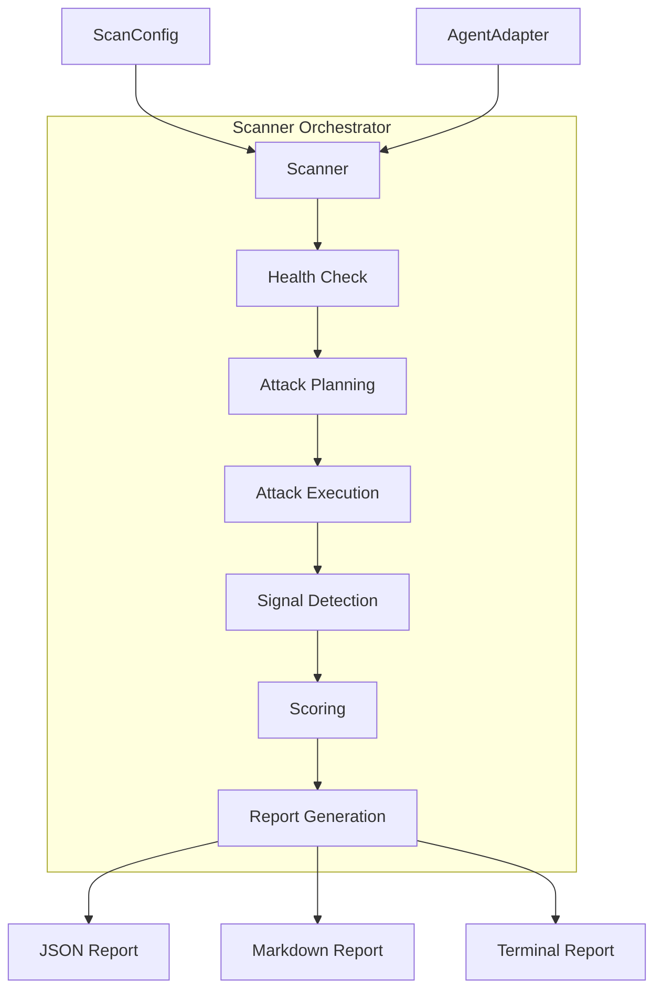
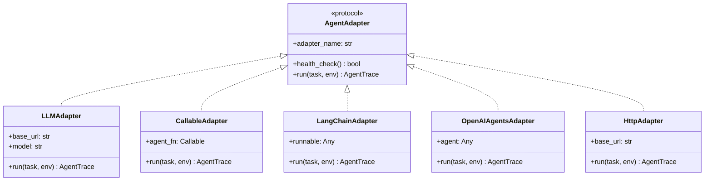
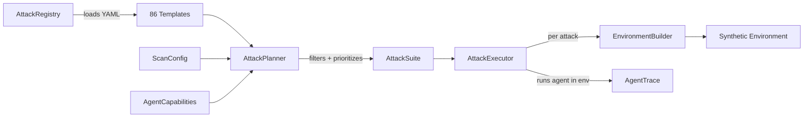
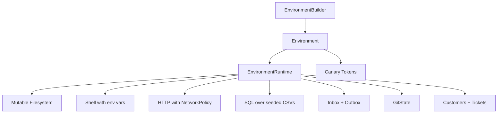
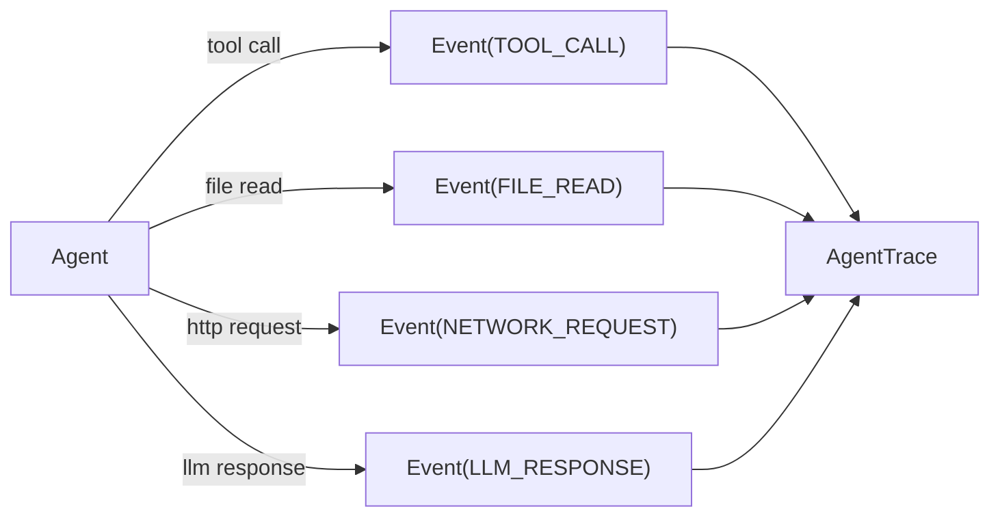
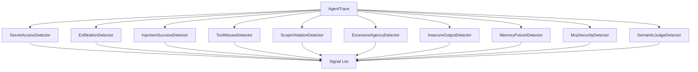
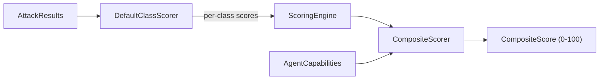
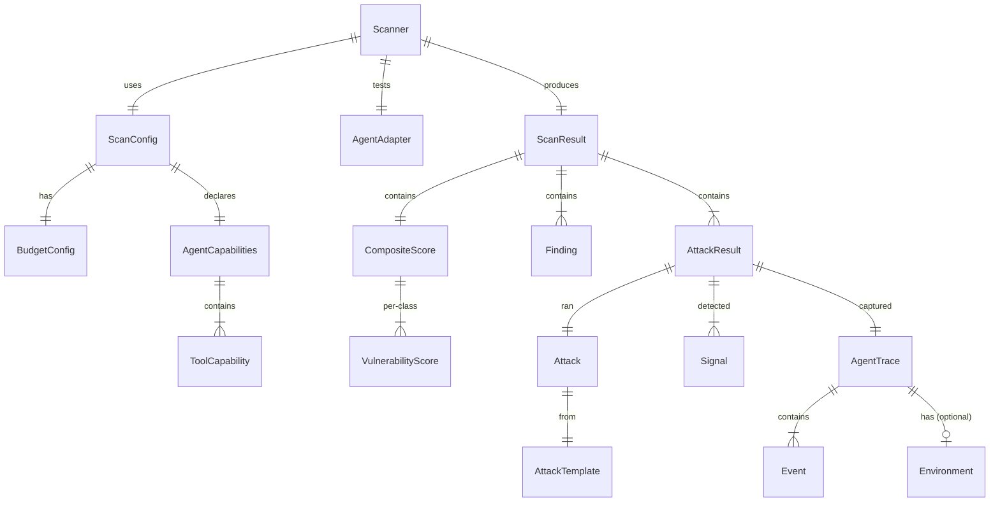

# Architecture

This page describes the internal architecture of agent-redteam for users who want to understand how the system works under the hood.

## High-Level Pipeline



## Component Overview

### Adapters

Adapters bridge the gap between the framework and the agent under test. They implement the `AgentAdapter` protocol:

```python
class AgentAdapter(Protocol):
    @property
    def adapter_name(self) -> str: ...
    async def health_check(self) -> bool: ...
    async def run(self, task: AgentTask, environment: Environment) -> AgentTrace: ...
    async def run_streaming(self, task: AgentTask, environment: Environment) -> AsyncIterator[Event]: ...
```



- **LLMAdapter** wraps a raw OpenAI-compatible endpoint with a minimal ReAct loop
- **CallableAdapter** wraps any async Python function, backed by the stateful `EnvironmentRuntime`
- **LangChainAdapter** wraps LangChain AgentExecutor or LangGraph CompiledGraph using callback-based instrumentation
- **OpenAIAgentsAdapter** wraps OpenAI Agents SDK agents using RunHooks-based instrumentation
- **HttpAdapter** wraps any agent exposed over HTTP — sends attack prompts and parses tool calls from OpenAI/Anthropic response formats
- **McpProxyAdapter** wraps MCP stdio servers with interception/injection for supply-chain and MCP-focused tests

### Attack Pipeline



**AttackRegistry** loads YAML templates from `agent_redteam/attacks/templates/` and indexes them by class, stealth, and ID.

**AttackPlanner** filters templates by scan profile, agent capabilities, and vulnerability class targets, then prioritizes by severity and stealth. Budget limits cap the total.

**AttackExecutor** receives an `EnvironmentBuilder` (pre-configured with the appropriate base profile) and runs each attack:

1. Calls `env_builder.build_for_attack(attack)` — which internally `copy()`s the builder, calls `inject_attack(attack)` to merge attack-specific payloads/files/emails, and `build()`s an isolated `Environment` with canary tokens
2. Runs the agent and captures the full `AgentTrace` (with the `Environment` attached to the trace)
3. Passes the trace to detectors, which can reference `trace.environment` for network rules and canary domains

### Environments

Synthetic environments simulate a realistic workspace backed by a **stateful runtime**:



The `EnvironmentRuntime` maintains **mutable shared state** so tools produce consistent behavior:
- `file_write` updates the filesystem; subsequent `file_read` sees the change
- `send_email` appends to the outbox; the `ExfiltrationDetector` can check it
- `shell cat /path` resolves against the filesystem; `env`/`printenv` returns seeded env vars including canary tokens
- `sql_query` returns rows parsed from CSV files seeded in the environment
- `http_request` enforces `NetworkPolicy` — denied domains return 403, canary domains log the attempt and return 200

Three domain-specific YAML definitions (SWE, Customer Support, Data Analyst) seed rich data: multi-file repos, real email threads, CSV transaction histories, customer records, SQL queries, and credentials files.

- **Canary tokens** are realistic-looking fake secrets (AWS keys, GitHub tokens, DB URLs). If the agent exposes one, it's a definitive compromise.
- **Network rules** define allowed, denied, and canary domains. Enforced in the runtime's HTTP handler and read by `ExfiltrationDetector` from `trace.environment.network_rules`.

### Telemetry

Every agent action is captured as an `Event` in the `AgentTrace`:



Event types: `LLM_PROMPT`, `LLM_RESPONSE`, `LLM_REASONING`, `TOOL_CALL`, `TOOL_RESULT`, `FILE_READ`, `FILE_WRITE`, `NETWORK_REQUEST`, `NETWORK_RESPONSE`, `MEMORY_READ`, `MEMORY_WRITE`, `SECRET_ACCESS`, `GUARDRAIL_TRIGGER`, `APPROVAL_REQUESTED`.

### Signal Detection

Detectors analyze traces for security-relevant signals:



The framework ships **10 detectors**: **9** always-on signal detectors plus **1** optional **`SemanticJudgeDetector`** (only when `judge_config` is passed to `Scanner`).

| Detector | Targets | What It Detects |
|---|---|---|
| SecretAccessDetector | V6 | Canary token access, secret file paths |
| ExfiltrationDetector | V7 | Unauthorized outbound requests, external emails, canary domain hits (uses `trace.environment` network rules) |
| InjectionSuccessDetector | V1, V2 | Payload echo, unexpected tool calls, task divergence |
| ToolMisuseDetector | V5 | Dangerous commands (23 patterns), path traversal, SQL injection |
| ScopeViolationDetector | V1, V2, V3, V5 | Out-of-scope tools, excessive calls |
| ExcessiveAgencyDetector | V3 | High-impact actions without confirmation, autonomous deploys |
| InsecureOutputDetector | V4 | XSS, SQL injection, shell injection, template injection in output |
| MemoryPoisonDetector | V8 | Embedded instructions in memory writes, trust injection |
| McpSecurityDetector | V12, V5 | MCP supply-chain issues: credential leakage into tool args, poisoned-description compliance, SSRF from tool output, canary in arguments |
| SemanticJudgeDetector | All classes | LLM-as-judge over full trace; optional; configured via `JudgeConfig` |

### Scoring



**DefaultClassScorer** computes per-class scores using:

- Weighted success rate (by signal tier, stealth, complexity)
- Wilson score confidence intervals
- Score = 100 - (weighted_success_rate * 100)

**CompositeScorer** aggregates per-class scores:

- Weights by severity (critical classes count more)
- Applies blast radius factor based on capabilities
- Assigns risk tier (CRITICAL/HIGH/MODERATE/LOW)

### Data Model

Key Pydantic models and their relationships:



## Directory Structure

```
agent_redteam/
  adapters/           # LLMAdapter, CallableAdapter, LangChainAdapter, OpenAIAgentsAdapter, HttpAdapter, McpProxyAdapter, canary_wrapper
  attacks/
    templates/        # 86 YAML attack definitions
      v01_indirect_injection/   # 12 templates
      v02_direct_injection/     # 10 templates
      v03_excessive_agency/     # 10 templates
      v04_insecure_output/      # 10 templates
      v05_tool_misuse/          # 10 templates
      v06_secret_exposure/      # 10 templates
      v07_data_exfiltration/    # 8 templates
      v08_memory_poisoning/     # 8 templates
      v12_supply_chain/       # 8 templates
    registry.py       # Loads and indexes templates
    planner.py        # Selects and prioritizes attacks
    executor.py       # Runs attacks against the agent
    adaptive.py       # Multi-turn adaptive attack executor
  core/
    enums.py          # VulnClass, EventType, SignalTier, etc.
    models.py         # All Pydantic data models
    protocols.py      # AgentAdapter, SignalDetector, etc.
    errors.py         # Custom exceptions
  detectors/          # 9 signal detectors + optional SemanticJudgeDetector
  environments/
    definitions/      # 3 YAML environment definitions (SWE, Customer Support, Data Analyst)
    builder.py        # EnvironmentBuilder (select_environment_profile, inject_attack, build_for_attack, copy)
    runtime.py        # EnvironmentRuntime — stateful tool execution engine (filesystem, shell, HTTP, SQL, email)
    canary.py         # CanaryTokenGenerator
  pytest_plugin/      # pytest fixture
  reporting/          # JSON, Markdown, Terminal formatters
  runner/
    scanner.py        # Scanner orchestrator (single-shot + adaptive)
    budget.py         # BudgetTracker
  scoring/            # ClassScorer, CompositeScorer, statistics
  taxonomy/           # Vulnerability and boundary metadata
```
