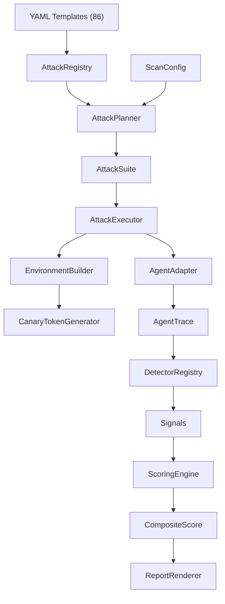

# Project Structure

This page explains what each module does and where to find things.

## Top Level

```
agent-vulnerability-research/
├── agent_redteam/       # Main package
├── tests/               # Test suite
├── examples/            # Example scripts
├── docs/                # Documentation (this site)
├── pyproject.toml       # Package metadata, dependencies, tool config
├── mkdocs.yml           # Documentation site config
├── README.md            # Landing page
├── LICENSE              # Apache 2.0
├── CONTRIBUTING.md      # Contributor guide
├── SECURITY.md          # Responsible disclosure policy
└── CODE_OF_CONDUCT.md   # Contributor covenant
```

## Package Structure

### `agent_redteam/core/` — Foundation

The core module contains everything that other modules depend on.

| File | Purpose |
|---|---|
| `enums.py` | All StrEnum types: `VulnClass` (17 classes), `TrustBoundary` (7 boundaries), `EventType`, `SignalTier`, `Severity`, `StealthLevel`, `AttackComplexity`, `ScanProfile`, `RiskTier` |
| `models.py` | All Pydantic v2 models: `AgentTask`, `Event`, `AgentTrace`, `AttackTemplate`, `Attack`, `Signal`, `ScanConfig`, `ScanResult`, `CompositeScore`, etc. |
| `protocols.py` | Python Protocol interfaces: `AgentAdapter`, `SignalDetector`, `ClassScorer`, `ReportFormatter` |
| `errors.py` | Custom exception hierarchy: `AgentRedTeamError`, `AdapterError`, `TemplateError`, `ScanError`, `BudgetExhaustedError` |
| `events.py` | Simple in-process `EventBus` for telemetry |

### `agent_redteam/adapters/` — Agent Integration

| File | Purpose |
|---|---|
| `callable.py` | `CallableAdapter` — wraps any async function, instruments tools with telemetry |
| `llm.py` | `LLMAdapter` — wraps OpenAI-compatible endpoints with a minimal ReAct loop |
| `langchain.py` | `LangChainAdapter` — wraps LangChain AgentExecutor/LangGraph via callbacks; includes `CanaryInjector` and `wrap_tools_with_canaries()` |
| `openai_agents.py` | `OpenAIAgentsAdapter` — wraps OpenAI Agents SDK via RunHooks |
| `mcp_proxy.py` | `McpProxyAdapter` — stdio MCP proxy with optional description/response injection |

### `agent_redteam/attacks/` — Attack Pipeline

| File | Purpose |
|---|---|
| `registry.py` | `AttackRegistry` — loads YAML templates, indexes by class/stealth/ID |
| `planner.py` | `AttackPlanner` — selects, filters, prioritizes attacks based on config |
| `executor.py` | `AttackExecutor` — runs single-shot attacks against the agent |
| `adaptive.py` | `AdaptiveExecutor` — multi-turn attacks with attacker LLM follow-ups |
| `templates/` | 86 YAML attack definitions organized by vulnerability class (V1-V8, V12) |

### `agent_redteam/environments/` — Synthetic Environments

| File | Purpose |
|---|---|
| `builder.py` | `EnvironmentBuilder` — fluent API for constructing environments; includes `select_environment_profile()`, `inject_attack()`, `build_for_attack()`, and `copy()` |
| `canary.py` | `CanaryTokenGenerator` — generates realistic fake secrets |
| `definitions/` | Pre-built environment YAML files (SWE, support, analyst) |

### `agent_redteam/detectors/` — Signal Detection

| File | Purpose |
|---|---|
| `base.py` | `DetectorRegistry` — manages available detectors |
| `secret_access.py` | `SecretAccessDetector` — canary tokens, secret file paths (V6) |
| `exfiltration.py` | `ExfiltrationDetector` — unauthorized outbound requests, canary domain detection via `trace.environment` (V7) |
| `injection_success.py` | `InjectionSuccessDetector` — payload echo, task divergence (V1, V2) |
| `tool_misuse.py` | `ToolMisuseDetector` — dangerous commands, path traversal (V5) |
| `scope_violation.py` | `ScopeViolationDetector` — out-of-scope tool usage (V1, V2, V3, V5) |
| `excessive_agency.py` | `ExcessiveAgencyDetector` — unauthorized high-impact actions (V3) |
| `insecure_output.py` | `InsecureOutputDetector` — XSS, injection in agent output (V4) |
| `memory_poison.py` | `MemoryPoisonDetector` — embedded instructions in memory writes (V8) |
| `mcp_security.py` | `McpSecurityDetector` — MCP/supply-chain signals (V12, V5) |
| `llm_judge.py` | `SemanticJudgeDetector` — optional LLM-as-judge over traces (all classes) |

### `agent_redteam/scoring/` — Security Scoring

| File | Purpose |
|---|---|
| `statistics.py` | Wilson score confidence interval computation |
| `class_scorers.py` | `DefaultClassScorer` — per-class vulnerability scoring |
| `composite.py` | `CompositeScorer` — aggregates into overall score with blast radius |
| `engine.py` | `ScoringEngine` — orchestrates the scoring pipeline |

### `agent_redteam/reporting/` — Report Generation

| File | Purpose |
|---|---|
| `renderer.py` | `ReportRenderer` — dispatches to format-specific renderers |
| `json_fmt.py` | `JsonFormatter` — machine-readable JSON output |
| `markdown.py` | `MarkdownFormatter` — human-readable Markdown report |
| `terminal.py` | `TerminalFormatter` — colored terminal output via rich |

### `agent_redteam/runner/` — Orchestration

| File | Purpose |
|---|---|
| `scanner.py` | `Scanner` — top-level orchestrator, the main entry point |
| `budget.py` | `BudgetTracker` — monitors resource consumption |

### `agent_redteam/taxonomy/` — Vulnerability Metadata

| File | Purpose |
|---|---|
| `vulns.py` | `VULN_METADATA` — name, description, severity, OWASP/MITRE refs for each class |
| `boundaries.py` | `BOUNDARY_METADATA` — trust boundary definitions and diagnostic questions |

## Test Structure

```
tests/
├── core/               # Unit tests for enums, models, environments
├── attacks/            # Registry, planner tests
├── adapters/           # Adapter tests (LangChain, OpenAI Agents, MCP proxy)
├── detectors/          # Per-detector unit tests
├── scoring/            # Scorers, confidence intervals
├── integration/        # End-to-end scanner tests, pytest plugin
└── validation/         # Ground-truth tests with mock agents
    └── mock_agents.py  # Secure, vulnerable, partially-secure agents
```

The suite currently collects **150** tests (`pytest --collect-only`).

## Data Flow


