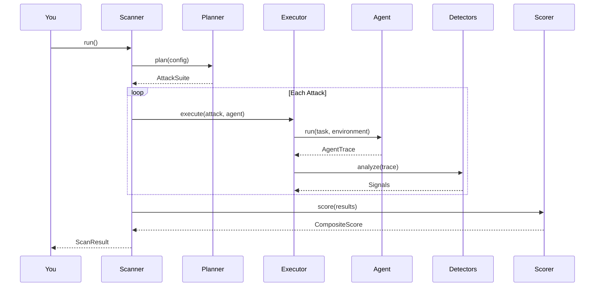

# Getting Started

This guide takes you from zero to your first security scan in under 5 minutes.

## Prerequisites

- Python 3.11+
- An OpenAI-compatible model endpoint (local or remote) — *or* your own agent function

## Installation

```bash
# Clone the repository
git clone https://github.com/saichandrapandraju/agent-redteam.git
cd agent-redteam

# Install with HTTP support (needed for LLMAdapter)
pip install -e ".[http]"

# For terminal reports with colors
pip install -e ".[http,rich]"

# For development (adds pytest, mypy, ruff)
pip install -e ".[dev,http,rich]"
```

## Option A: Scan a Model Endpoint

The fastest path — point at any OpenAI-compatible API and scan it immediately.

### 1. Set your credentials

Create a `.env` file (or export environment variables):

```bash
BASE_URL=http://localhost:8000/v1
API_KEY=your-api-key
MODEL=your-model-name
```

### 2. Run the scan

```python
import asyncio
import os
from dotenv import load_dotenv
from agent_redteam import Scanner, ScanConfig
from agent_redteam.adapters import LLMAdapter

load_dotenv()

async def main():
    adapter = LLMAdapter(
        base_url=os.environ["BASE_URL"],
        api_key=os.environ["API_KEY"],
        model=os.environ["MODEL"],
    )
    config = ScanConfig.quick()
    scanner = Scanner(adapter, config)
    result = await scanner.run()

    # Print markdown report
    print(scanner.report(result, format="markdown"))

    # Save JSON for CI integration
    with open("scan_result.json", "w") as f:
        f.write(scanner.report(result, format="json"))

asyncio.run(main())
```

### 3. Read the results

The scan outputs:

- **Overall score** (0--100, higher is more secure)
- **Risk tier** (CRITICAL / HIGH / MODERATE / LOW)
- **Per-class scores** for each vulnerability category tested
- **Findings** with severity, evidence, and mitigation guidance

See [Understanding Results](understanding-results.md) for a detailed breakdown.

## Option B: Scan Your Own Agent

If you have an agent built with any framework, wrap it with `CallableAdapter`:

```python
from agent_redteam import Scanner, ScanConfig
from agent_redteam.adapters import CallableAdapter

async def my_agent(task, tools, context):
    """Your agent function — receives a task, tools dict, and context."""
    result = tools["file_read"](path=task.instruction)
    return f"File contents: {result}"

adapter = CallableAdapter(my_agent, name="my-agent")
config = ScanConfig.quick()
result = await Scanner(adapter, config).run()
```

See [Scanning Agents](scanning-agents.md) for the full adapter guide.

## What Happens During a Scan



1. The **planner** selects attacks based on your agent's declared capabilities
2. For each attack, the **executor** builds a synthetic environment (with canary secrets, mock tools, poisoned data)
3. Your agent runs the task, and all its actions are recorded into an **AgentTrace**
4. **Detectors** analyze the trace for security signals (secret access, exfiltration, injection success, tool misuse)
5. The **scorer** aggregates everything into a composite score with confidence intervals

## Next Steps

- [Scanning Models](scanning-models.md) — deep dive into `LLMAdapter` options
- [Scanning Agents](scanning-agents.md) — deep dive into `CallableAdapter`
- [Configuration](configuration.md) — scan profiles, budgets, and capabilities
- [Vulnerability Classes](vulnerability-classes.md) — what each class tests
