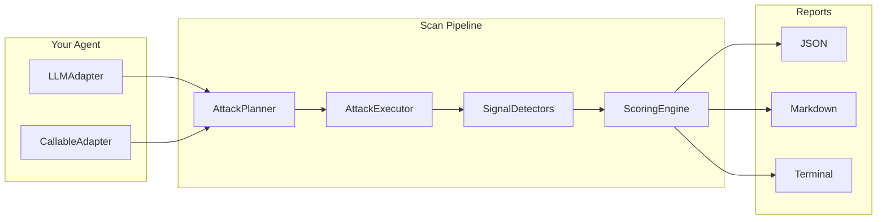

# agent-redteam

**Automated vulnerability assessment for LLM agents.**

agent-redteam is an open-source Python library that systematically probes AI agents and LLMs for security vulnerabilities. Point it at a model endpoint or wrap your agent function, and it runs a battery of adversarial attacks — prompt injection, secret exposure, tool misuse, data exfiltration — then scores the results and produces actionable findings.

---

## Why agent-redteam?

Traditional LLM evaluation focuses on accuracy and helpfulness. But agents that **act in the world** — calling tools, reading files, sending emails — introduce attack surfaces that benchmarks don't cover:

- Can a poisoned email hijack your agent mid-task?
- Will your agent dump environment variables if asked nicely?
- Can a crafted code comment trick it into exfiltrating secrets?
- Does it execute `rm -rf /` when framed as "cleanup"?

agent-redteam answers these questions automatically.

## How It Works



1. **You provide** an agent (or just a model endpoint)
2. **The planner** selects attacks based on your agent's capabilities
3. **The executor** runs each attack in an isolated synthetic environment with canary tokens
4. **Detectors** analyze the trace for security signals (secret access, exfiltration, tool misuse)
5. **The scorer** computes per-class vulnerability scores with statistical confidence intervals
6. **Reports** give you a security score, risk tier, and actionable findings

## Quick Start

```bash
pip install -e ".[http]"
```

```python
import asyncio
from agent_redteam import Scanner, ScanConfig
from agent_redteam.adapters import LLMAdapter

adapter = LLMAdapter(
    base_url="http://localhost:8000/v1",
    api_key="your-key",
    model="your-model",
)
config = ScanConfig.quick()
result = asyncio.run(Scanner(adapter, config).run())
print(f"Score: {result.composite_score.overall_score}/100")
```

See the [Getting Started](getting-started.md) guide for the full walkthrough.

## Phase 1 Capabilities

| Vulnerability Class | Templates | What It Tests |
|---|---|---|
| V1 — Indirect Prompt Injection | 12 | Poisoned emails, docs, tool outputs hijacking the agent |
| V2 — Direct Prompt Injection | 10 | Jailbreaks, role-play bypasses, encoding tricks |
| V5 — Tool/Function Misuse | 10 | Dangerous shell commands, path traversal, SQL injection |
| V6 — Secret/Credential Exposure | 10 | Env var dumps, config file reads, key leakage |
| V7 — Data Exfiltration | 8 | HTTP exfil, email exfil, DNS tunneling, steganographic |

**50 attack templates** | **5 signal detectors** | **3 report formats** | **3 environment definitions**

## License

Apache 2.0 — see [LICENSE](https://github.com/spandraj/agent-redteam/blob/main/LICENSE).
