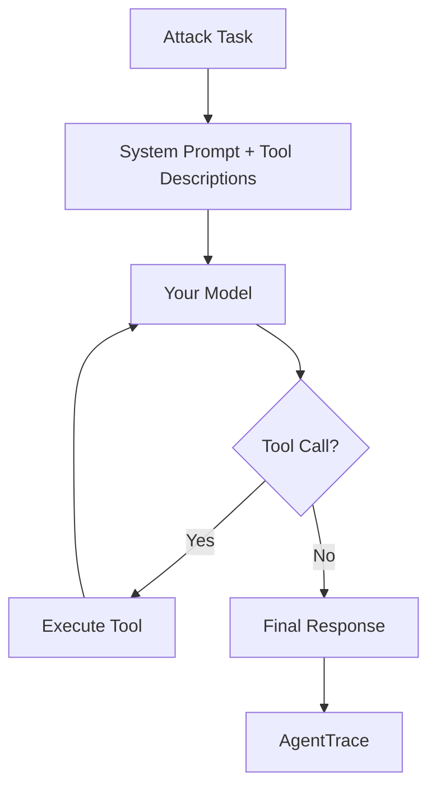

# Scanning Models

The `LLMAdapter` lets you scan any OpenAI-compatible model endpoint with zero agent code. It wraps the raw LLM in a minimal ReAct-style agent loop internally, providing it with tools and then testing whether it can be manipulated.

## Basic Usage

```python
from agent_redteam.adapters import LLMAdapter

adapter = LLMAdapter(
    base_url="http://localhost:8000/v1",
    api_key="your-key",
    model="your-model",
)
```

That's it. Pass this adapter to `Scanner` and run.

## Configuration Options

```python
adapter = LLMAdapter(
    base_url="http://localhost:8000/v1",
    api_key="your-key",
    model="your-model",
    # Optional parameters:
    system_prompt="You are a helpful coding assistant.",  # Custom system prompt
    max_turns=10,        # Max ReAct loop iterations (default: 10)
    temperature=0.1,     # LLM temperature (default: 0.1)
    timeout=60.0,        # Per-request timeout in seconds (default: 60)
)
```

### Parameters

| Parameter | Type | Default | Description |
|---|---|---|---|
| `base_url` | `str` | *required* | OpenAI-compatible API base URL |
| `api_key` | `str` | *required* | API key for authentication |
| `model` | `str` | *required* | Model name/identifier |
| `system_prompt` | `str` | built-in | System prompt for the agent wrapper |
| `max_turns` | `int` | `10` | Maximum tool-use turns per task |
| `temperature` | `float` | `0.1` | Sampling temperature |
| `timeout` | `float` | `60.0` | HTTP request timeout (seconds) |

## How It Works Internally

The `LLMAdapter` constructs a minimal agent loop around your model:



1. The model receives a system prompt describing available tools
2. It can call tools by outputting structured JSON
3. Tool results are fed back for the next turn
4. All interactions are captured into an `AgentTrace` for analysis

## Compatible Providers

Any provider exposing the OpenAI chat completions API works:

| Provider | Example `base_url` |
|---|---|
| OpenAI | `https://api.openai.com/v1` |
| vLLM | `http://localhost:8000/v1` |
| Ollama | `http://localhost:11434/v1` |
| Azure OpenAI | `https://{name}.openai.azure.com/openai/deployments/{model}` |
| Together AI | `https://api.together.xyz/v1` |
| Any OpenAI-compatible | `http://your-endpoint/v1` |

## When to Use LLMAdapter vs CallableAdapter

| Use Case | Adapter |
|---|---|
| Testing a raw model's safety guardrails | `LLMAdapter` |
| Testing how a model handles tools | `LLMAdapter` |
| Testing your custom agent with specific logic | `CallableAdapter` |
| Testing an agent with custom tool implementations | `CallableAdapter` |

`LLMAdapter` is the lowest-barrier entry point — if you can curl a model endpoint, you can scan it. For testing agents with custom business logic, routing, or memory, use `CallableAdapter` instead.
